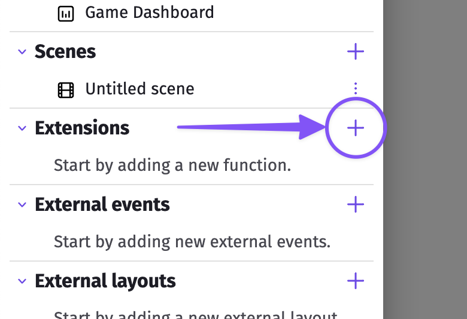
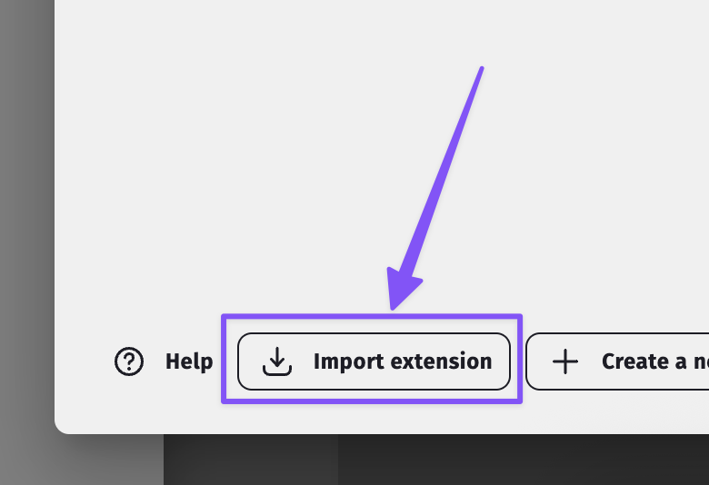
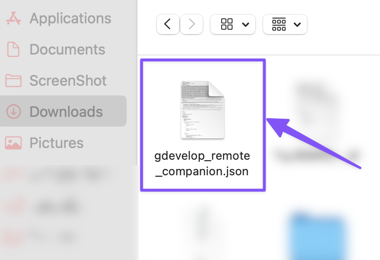
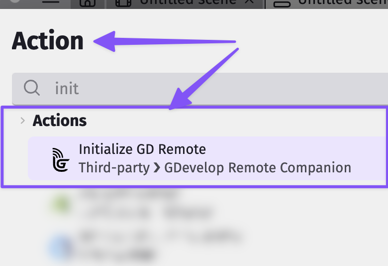
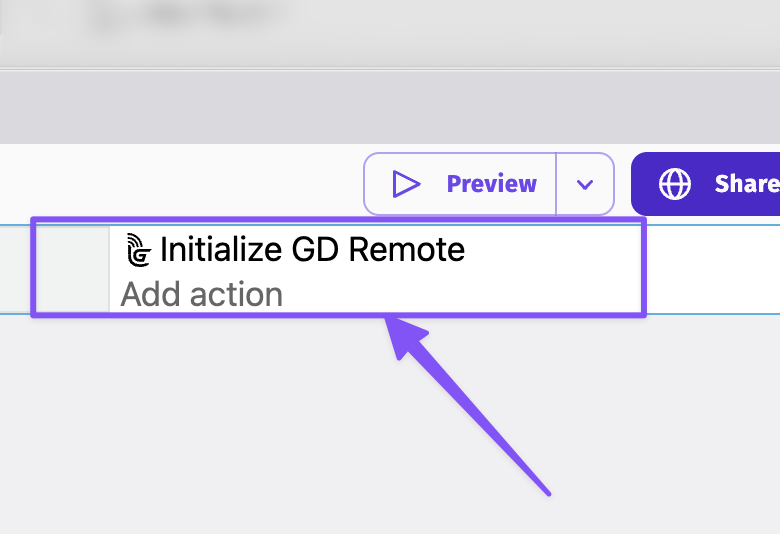

# GDevelop Remote Companion Extension

## Overview

The GDevelop Remote Companion Extension allows you to remotely control and interact with your GDevelop projects running on PC or browser using your mobile device. It enables real-time remote event triggering for testing, debugging, and enhancing your development workflow.

## Download Extension

Click the link below to download the latest version of the extension:

[⬇️ Download Extension](https://github.com/TheGemDev/GDevelopRemoteCompanion/releases/latest/download/gdevelop_remote_companion.json)

---

## How to Install

Follow these steps to install the GDevelop Remote Companion Extension into your GDevelop project:

1. **Download the extension file** using the link above.
2. **Open GDevelop** and go to **Project Manager → Extensions**.
3. In the Extensions dialog, click **"In Extensions click on the"** (search box or specific UI element).
4. At the bottom left of the **"Search for new extensions"** dialog, click **"Import Extension"**.
5. Select the downloaded file: `gdevelop_remote_companion.json`.
6. The extension will appear in your list of extensions.
7. Add the **"Initialize GD Remote"** event action to any of your scenes.
8. You only need one of this action in your app so it can communicate with the remote.
9. Run your project and enjoy ⭐️.

---

## Screenshots

Open GDevelop and go to Project Manager → Extensions.

Click "In Extensions click on the..."

At the bottom left, click "Import Extension".

Select the downloaded file.

Extension appears in your list.

Add "Initialize GD Remote" event action.

Only one such action is needed.

---

## Notes

- The extension file is versioned and available on GitHub Pages for download.
- Use query parameter `?version=x.y.z` to download specific versions.

Example:
